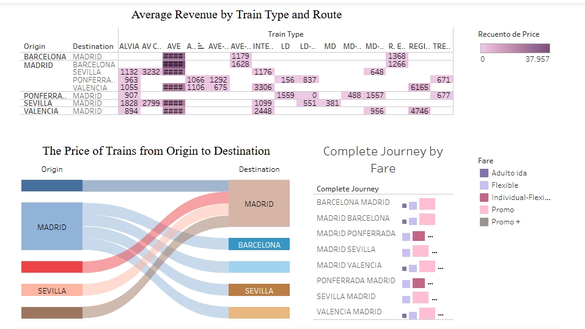

# Tableau_project_AVE
Analysis of AVE train revenues in Spain, highlighting top-performing routes like Madrid–Barcelona and Madrid–Sevilla. It visualizes pricing, demand, and fare type distribution to understand high-speed rail profitability.

## Dashboard Preview

[View interactive version on Tableau Public](https://public.tableau.com/app/profile/victoria.komissarchik.trubitsyna/viz/AVE_dashboard_/Dashboard1?publish=yes)
